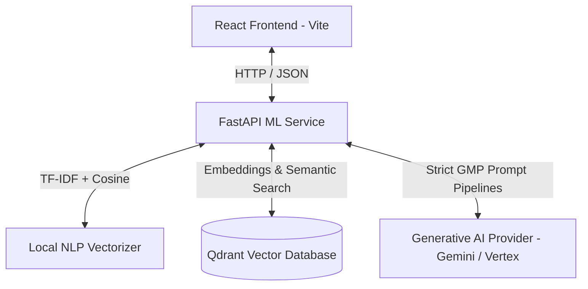

# GxP Semantic Recommendation and AI Refinement Platform

An end-to-end, intelligent enterprise solution for Pharmaceutical and Life Sciences Quality Management Systems (QMS). This platform combines advanced semantic retrieval and Generative AI to streamline quality investigations, ensure regulatory compliance, and assist QA/QC professionals in writing audit-ready reports.

---

## 🚀 Key Use Cases

### 1. Deviation Investigation & Analysis (DVMS)
* **Semantic Pattern Matching:** Automatically scans newly reported deviation titles and descriptions against historical records to find similar past events.
* **Root Cause & CAPA Recommendations:** Recommends historical root causes and successfully implemented Corrective and Preventive Actions (CAPA) to accelerate resolution times.
* **Vector-Driven Insights:** Powered by a dual-engine architecture utilizing both traditional NLP (TF-IDF + Cosine Similarity) and high-dimensional semantic search.

### 2. Out of Specification (OOS) Resolution
* **Multi-Phase Investigation Mapping:** Provides targeted data retrieval and tracking across Laboratory Phase 1 (Phase 1A/1B) and Full Investigation Phase 2 stages.
* **Specification Limit Analytics:** Cross-references observed test results against specified limits to identify patterns, sample anomalies, or instrument-specific issues.
* **Audit-Ready Summaries:** Synthesizes complex analytical testing failures into clear, sequential event timelines.

### 3. Regulatory Content Refinement (AI Compliance Copilot)
* **GxP & ALCOA Compliance:** Automatically refines raw, draft investigation notes into formal, scientific, and audit-ready language compliant with FDA, GMP, and MHRA guidelines.
* **Data Integrity Enforcement:** Leverages advanced generative models with strict prompt engineering constraints to ensure that no technical data, batch IDs, sample weights, names, or values are modified or fabricated during the refinement process.
* **Field-Specific Control:** Separates and tailors refinement logic specifically for Event Descriptions, Investigation Findings, and Impact Assessments.

---

## 🛠️ Architecture & Tech Stack

The platform is designed as a modern, decoupled multi-service ecosystem:



* **Frontend (React + Vite):** A modern, responsive, and interactive user interface designed for QA analysts to search historical events and edit/refine investigation reports.
* **ML Service (FastAPI + Python):** The central cognitive engine handling router management, text vectorization, Qdrant database orchestration, and Generative AI prompt construction.
* **Vector Search (Qdrant):** High-performance vector database storing and matching high-dimensional embeddings of deviations and OOS records.
* **AI Engine (Gemini / LLM Providers):** State-of-the-art Large Language Models configured with strict contextual constraints to perfect quality records without compromising factual accuracy.

---

## 📁 Repository Structure

```
gxp-semantic-recommendation-and-ai-refinement/
├── frontend/               # React + Vite application (UI)
│   ├── src/
│   └── package.json
├── ml-service/             # FastAPI backend (ML, LLM, Vector Search)
│   ├── app/
│   │   ├── core/           # Response handling & global configs
│   │   ├── db/             # Qdrant client connection
│   │   ├── domains/        # Domain-driven modules
│   │   │   ├── common/     # Shared models and utilities
│   │   │   ├── dvms/       # Deviation similarity & refinement services
│   │   │   └── oos/        # Out-of-Specification similarity & refinement services
│   │   └── main.py         # App entry point & router mounting
│   ├── requirements.txt
│   └── .env
└── README.md
```

---

## 🚦 Getting Started

### 1. Set Up the ML Service (Python)
Navigate to the machine learning service directory, set up your environment, and spin up the server:
```bash
cd ml-service

# Create and activate virtual environment
python -m venv .venv
source .venv/bin/activate  # On Windows use: .venv\Scripts\activate

# Install dependencies
pip install -r requirements.txt

# Configure environment variables (Add your Gemini API Key & Qdrant credentials)
cp .env.example .env

# Start the service
uvicorn app.main:app --reload
```
*The ML Service API will be available at:* **`http://localhost:8000`**  
*Interactive Swagger documentation:* **`http://localhost:8000/docs`**

### 2. Set Up the Frontend (React)
Open a new terminal window, navigate to the frontend directory, install dependencies, and launch the development server:
```bash
cd frontend

# Install packages
npm install

# Run application
npm run dev
```
*The interactive dashboard will be available at:* **`http://localhost:5173`**

---

## 🛡️ Regulatory Compliance Statement
This software solution has been built with strict adherence to **ALCOA principles** (Attributable, Legible, Contemporaneous, Original, and Accurate). All generative AI modules contain hard-coded guardrails preventing the fabrication of records, modification of raw specifications, or unauthorized data extrapolation, making it fully ready for computer systems validation (CSV) under 21 CFR Part 11.
